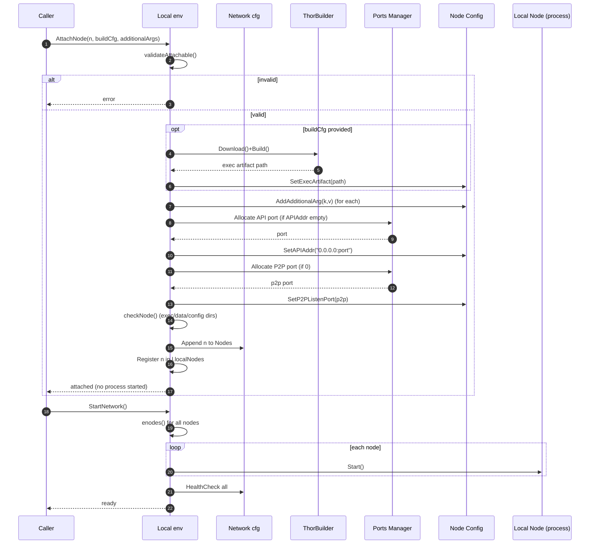
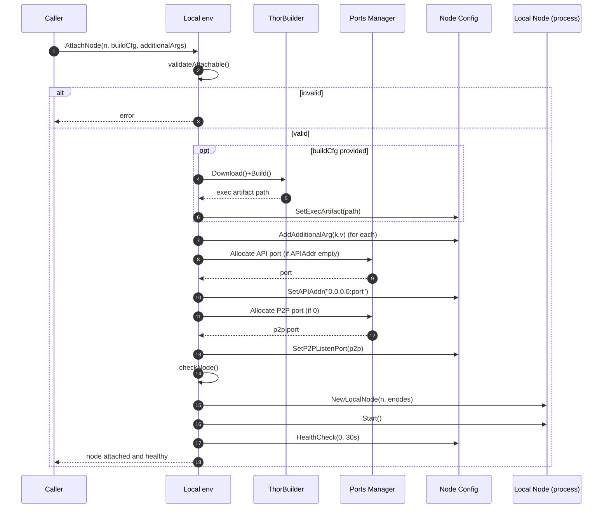
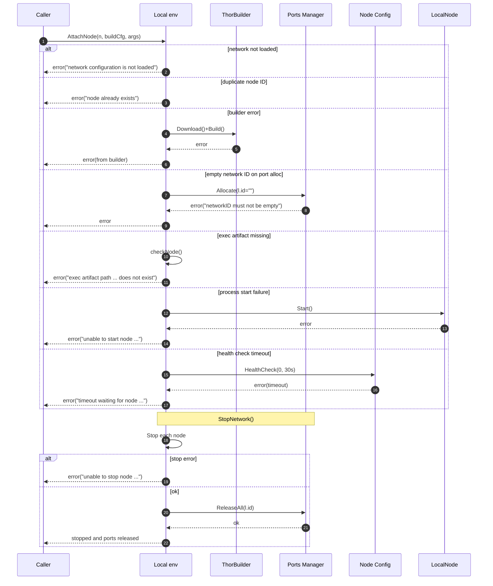
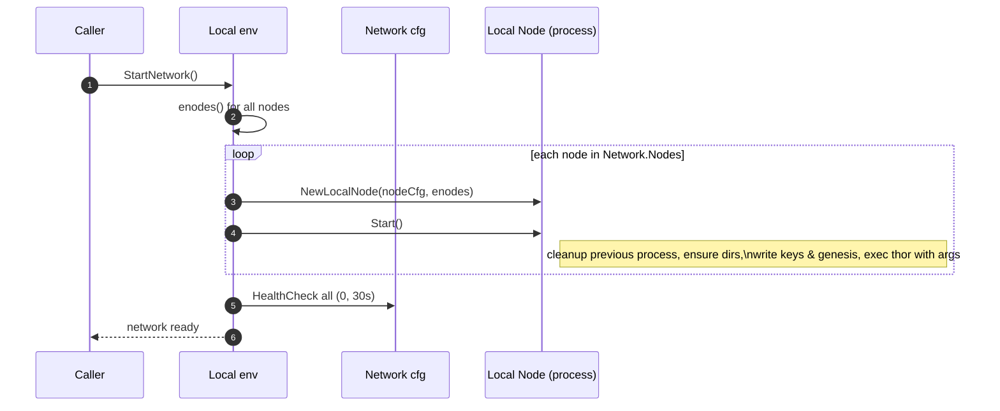
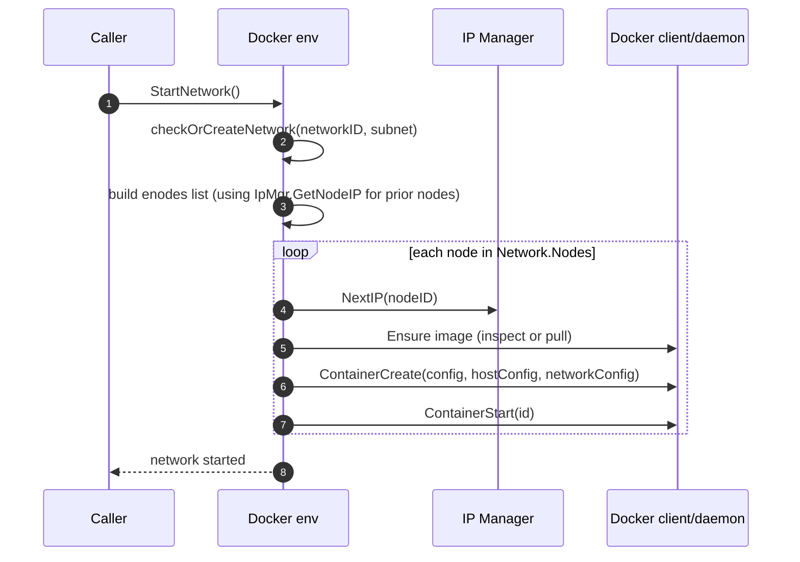

## NetworkHub: Create and Run Custom Thor Networks

This guide shows multiple ways to spin up Thor networks with NetworkHub:
- Using built-in presets
- Manually with the Local environment (spawn native thor processes)
- Manually with the Docker environment (spawn thor in containers)
- Advanced: custom genesis, attaching/removing nodes at runtime, additional args

### Prerequisites
- Go 1.21+
- macOS/Linux
- Docker (only for the Docker environment)

### Conventions used below
- The imports assume you are inside a Go module and can import this repo packages.
- Many examples use `thorbuilder.DefaultConfig()` which honors environment variables:
  - `THOR_WORKING_DIR`: if set, builder uses an existing working directory and performs a local build
  - `THOR_BRANCH`: if set, builder downloads the Thor repo and checks out this branch; defaults to `master`

## 1) Using the presets

Presets give you ready-to-run topologies plus a sensible genesis. You can run them either in the Local or Docker environments.

### 1.1 Local environment with a preset
```go
package main

import (
    "log"
    "time"

    envlocal "github.com/vechain/networkhub/environments/local"
    "github.com/vechain/networkhub/preset"
    "github.com/vechain/networkhub/thorbuilder"
    "github.com/vechain/thor/v2/thorclient"
)

func main() {
    // Build or fetch thor based on env vars (THOR_WORKING_DIR / THOR_BRANCH)
    cfg := thorbuilder.DefaultConfig()

    // Choose a preset
    net := preset.LocalThreeMasterNodesNetwork()
    net.ThorBuilder = cfg // Local env will build thor and set the exec path

    // Create local environment, load, start
    env := envlocal.NewEnv()
    if _, err := env.LoadConfig(net); err != nil {
        log.Fatal(err)
    }
    if err := env.StartNetwork(); err != nil {
        log.Fatal(err)
    }
    defer env.StopNetwork()
}
```

Notes:
- If a node’s `APIAddr` is empty, Local automatically allocates an available port and binds on `0.0.0.0`.
- If a node’s P2P port is zero/missing, Local automatically allocates one.

### 1.2 Docker environment with a preset
```go
package main

import (
    "log"

    envdocker "github.com/vechain/networkhub/environments/docker"
    "github.com/vechain/networkhub/preset"
    "github.com/vechain/networkhub/thorbuilder"
)

func main() {
    // Build a Docker image from Thor based on env vars
    cfg := thorbuilder.DefaultConfig()

    net := preset.LocalSixNodesNetwork()
    net.ThorBuilder = cfg // Docker env will build a docker image and assign it to nodes

    env := envdocker.NewEnv()
    if _, err := env.LoadConfig(net); err != nil {
        log.Fatal(err)
    }
    if err := env.StartNetwork(); err != nil {
        log.Fatal(err)
    }
    defer env.StopNetwork()
}
```

Notes:
- Alternatively, you can set each node’s `ExecArtifact` to a prebuilt image tag (e.g. `vechain/thor:latest`).
- Docker env exposes each node’s API port on localhost; host ports are derived from node configuration during `LoadConfig`.

## 2) Advanced usage

### 2.1 Attaching a node at runtime (Local environment)
```go
// Assume env := envlocal.NewEnv() and env.StartNetwork() already called
// Reuse the same genesis that the network uses
g := env.Config().Nodes[0].GetGenesis()

newNode := &node.BaseNode{
    ID:        "nodeX",
    Type:      node.RegularNode,
    APICORS:   "*",
    Verbosity: 3,
    Key:       "<hex private key>",
    Genesis:   g,
}

// Optional: additional args passed to thor (e.g., enable specific tracers)
args := map[string]string{"api-allowed-tracers": "call"}

// If you didn’t provide net.ThorBuilder during LoadConfig, set ExecArtifact here
// newNode.SetExecArtifact("/path/to/thor")

if err := env.AttachNode(newNode, nil, args); err != nil {
    panic(err)
}
```

### 2.2 Removing a node at runtime (Local environment)
```go
if err := env.RemoveNode("nodeX"); err != nil {
    panic(err)
}
```

### 2.3 Accessing node HTTP endpoints
```go
for id, n := range env.Nodes() {
    // n implements node.Lifecycle, original configs are in env.Config().Nodes
    _ = id
}

// From the original configs:
for _, nc := range env.Config().Nodes {
    // GetHTTPAddr converts 0.0.0.0 bindings to 127.0.0.1 for convenience
    addr := nc.GetHTTPAddr()
    _ = addr
}
```

### 2.4 Port management notes (Local environment)
- API port and P2P port allocation use an in-process port manager keyed by network ID (`Environment + BaseID`).
- Ports are reserved on start and released on `StopNetwork()`.
- You can provide explicit `APIAddr` or `P2PListenPort` if you need fixed values; otherwise, leave empty/zero and let the manager allocate.

## Flow diagrams

### Scenario 1: Network not started → Attach node → Start network


### Scenario 2: Network started → Attach node


### Corner cases and error flows


### Starting a network (Local environment)


### Starting a network (Docker environment)

